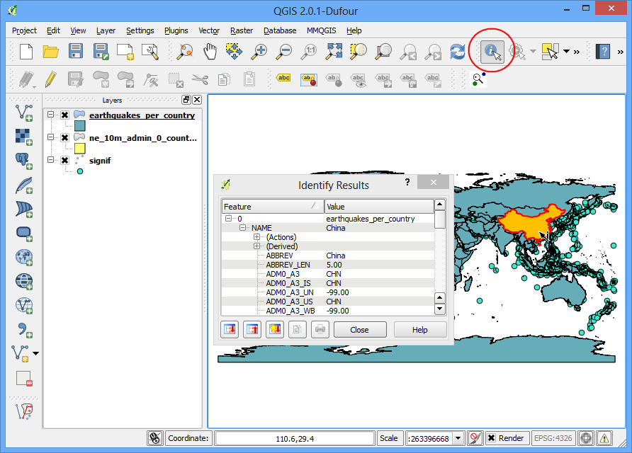

# Points in Polygons Analysis

In this exercise you will count points in polygons by looking at earthquakes and countries.

Based on Ujaval Ghandi's http://www.qgistutorials.com/en/docs/points_in_polygon.html and licensed under 
[Creative Commons Attribution 4.0 International License](http://creativecommons.org/licenses/by/4.0/deed.en_US)

Assignment deliverables: Screenshot of QGIS project showing chloropleth map and results of Identify Tool, similar to below:




## Directions
### Points in Polygon Analysis
The power of GIS lies in analysing multiple data sources together. Often the answer you are seeking lies in many different layers and you need to do some analysis to extract and compile this information. One such type of analysis is Points-in-Polygon. When you have a polygon layer and a point layer - and want to know how many or which of the points fall within the bounds of each polygon, you can use this method of analysis.

### Overview of the task
Given the locations of all known significant earthquakes, we will try to find out which country has had the highest number of earthquakes.

### Get the data
We will use NOAA’s National Geophysical Data Center’s [Significant Earthquake Database](http://www.ngdc.noaa.gov/nndc/struts/form?t=101650&s=1&d=1)
as our layer represenging all major earthquakes. Download the [tab-delimited earthquake data](http://www.ngdc.noaa.gov/nndc/struts/results?type_0=Exact&query_0=$ID&t=101650&s=13&d=189&dfn=signif.txt).

Natural Earth has [Admin 0 - Countries](http://www.naturalearthdata.com/downloads/10m-cultural-vectors/) dataset. 
Download the [countries](http://www.naturalearthdata.com/http//www.naturalearthdata.com/download/10m/cultural/ne_10m_admin_0_countries.zip)

For convenience, you may directly download a copy of the dataset from the link below:

[signif.txt](../data/signif.txt)

[ne_10m_admin_0_countries.zip](../data/ne_10m_admin_0_countries.zip)

Data Sources: [NGDC] [NATURALEARTH]

## Procedure
Open Layer ‣ Add Delimited Text Layer and browse to the downloaded signif.txt file.

../_images/1131.png

Since this is a tab-delimited file, choose Tab as the File format. The X field and Y field would be auto-populated. Click OK.

```
Note

You may see some error messages as QGIS tries to import the file. These are valid errors and some rows from the file will not be imported. You can ignore the errors for the purpose of this tutorial.
```

../_images/289.png

As the earthquake dataset has Latitude/Longitude coordinates, choose WGS 84 EPSG:436 as the CRS in the Coordinate Reference System Selector dialog.

../_images/349.png

The earthquake point layer would now be loaded and displayed in QGIS. Let’s also open the Countries layer. Go to Layer ‣ Add Vector Layer. Browse to the downloaded ne_10m_admin_0_countries.zip file and click Open. Select the ne_10m_admin_0_countries.shp as the layer in the Select layers to add... dialog.

../_images/430.png

Click on Vector ‣ Analysis Tools ‣ Point in Polygon

../_images/531.png

In the pop-up window, select the polygon layer and point layer respectively. Name the output layer as earthquake_per_coutry.shp and Click OK.

```
Note

Be patient after clicking OK, QGIS may take upto 10 minutes to calculate the results.
```
When asked whether you want to add the layer to TOC, click Yes.

../_images/728.png

You will see a new layer is added to the table of content. Open the attribute table by right-clicking on the layer and selecting Open Attribute Table.

../_images/825.png

In the attribute table, you will notice a new field named PNTCNT. This is the count of number of points from the earthquakes layer that fall within each polygon.

../_images/925.png

To get our answer, we can simply sort the table by PNTCNT field and the country with highest count will be our answer. Click 2-times on the PNTCNT column to get it sorted in descending order. Click on the first row to select it and close the Attribute Table.

../_images/1024.png

Back in the main QGIS window, you will see one feature highlighted in yellow. This is the feature linked to the selected row in the attribute table which had the highest number of points. Select the Identify tool and click on that polygon. You can see that the country with the highest number of Significant earthquakes is China.

../_images/1132.png

We determined from the simple analysis of 2 datasets that China has had the highest number of major earthquakes. You may refine this analysis further by taking into consideration the population as well as the size of the country and determine which is the most adversely affected country by major earthquakes.
