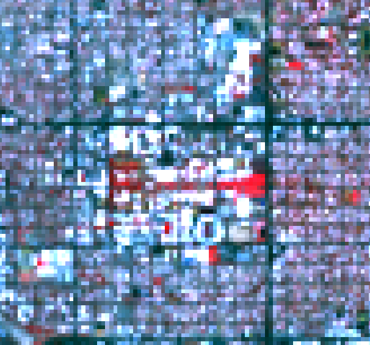

Landsat Classification with QGIS

Example adapted from [https://www.igismap.com/image-classification-in-qgis-supervised-and-unsupervised-classification/](https://www.igismap.com/image-classification-in-qgis-supervised-and-unsupervised-classification/) 

Download Landsat Data from 

[https://landsatonaws.com/L8/036/038/](https://landsatonaws.com/L8/036/038/) -- Choose a recent cloud-free scene (e.g., June 25, 2018). Download all the geotiffs from bands 1-9. Download the Metadata File ending in MTL.txt. 

Start QGIS and enable Semi-Automatic Classification plugin. 

After installation of the plugin if toolbox on the screen of the same is not showing by default then, then click View -> Panels. Check both the panels SCP: ROI creation and SCP: classification.

Now click toolbar and activate SCP toolbar.

Your Desktop QGIS screen will look like this below image.

Now Click on pre-processing tool and select the folder in which all the images and MTL file is present.

Check these two options i.e Apply DOS1 Atmospheric Correction and  Create Virtual Raster as shown below.

Now click on perform conversion. The processing may take some time. 

Remove bands 10, 11, and 12 from the QGIS Layers Menu.

Im the Semi-Automatic Classification Plugin window, click on Band Set (or select it from SCP Menu -> Band Set)

Click the "Run" button on the bottom right to create the stack. When it is done, you will see a “stack_raster.tif” layer in your layer list. 

Right click on the stack and look at Properties and Style. The Render type should be "Multiband color" and will default to R, G, and B=bands 1, 2, 3. Change it to R, G and B=bands 4, 3, 2. This is a “false color composite” and will make vegetation look red.

Set the contrast enhancement to "Stretch to MinMax" and click “Apply”. The image may look washed out, depending how the min-max stretch turned out. Click on the “Histogram” menu item on the left. Next, compute histograms. The idea behind using the histogram to set the min-max is that outlier values can cause our min-max stretch to bias one or more bands and wash out our image. You will select appropriate Min and Max values based on each band based on the histogram. Imagine that you are taking the “middle 95%” of values in the histogram and setting the Min to be at the bottom of that middle 95% and the Max to be at the top of that 95%.

In the example above, Band 4, which is the Near-Infrared band but rendered in the "Red" channel of the false color composite, has a histogram that starts to rise around 0.12, peaks at 0.22, and falls to 0 near 0.45. We set the “Min” and “Max” based on chopping off the curve right at the bottom shoulder above 0 on either side. To use the histogram to select the min/max, click on the  icon and then click on the graph. Click “Apply” to see the effects of your selection. The style on your Landsat Image should ultimately look something like this: 

Look around your image. Zoom in and out to areas that you are familiar with. Look specifically at parks, roads, parking lots, buildings, desert, washes, cleared areas, forest, hills, and different types of geologic features. Play around with the styles to make things "make sense" to you. Note that at 30m resolution, it may take some intuition and problem solving to determine what everything is. For example, here is the U of A: 

Vegetation is red, roofs are white, streets are dark grey, and residential areas are a mix of colors that vary from white (roofs) to vegetated yards (pink) and roads (grey). 

Next, we will start selecting points for our classification. This entails creating ROIs containing many points for each class we wish to classify.

To create "signatures" for your classes:

Create a training input vector file in the SCP input section of the SCP dock. 

In the SCP toolbar, click "Create a ROI Polygon". Select an area that is representative of your class. Use the “Actrivate ROI” pointer tool as an alternative.

 

If you are satisfied with the area selected, right click to bring up the signature list. Double click on "MC Info" to edit the name of your signature. 

Create classes for:

Vegetation

Streets

Bare ground

Desert

Residential

Important! For each class, create a unique "MC ID" starting with 1 (leave 0 for unclassified, as you’ll see tomorrow)

Save your ROI using the "Save" icon (which looks like a disk)

To make sure your classes are working out, click on the "Preview" radio button in the SCP toolbar. A quick classification will be drawn in your view:

Once you have created all your classes, open your Classification dock. You should see your ROI Signature list with the unique MC IDs.

Next, open "Classification algorithm. In the drop-down, change to “Spectral Angle Mapper", then click the classification preview again. 

Finally, in the "Classification output", enable “Classification Report” and click “Run”

Help from [https://arset.gsfc.nasa.gov/sites/default/files/land/webinars/Advanced_Land_Classification/supervised_exercise_v2.pdf](https://arset.gsfc.nasa.gov/sites/default/files/land/webinars/Advanced_Land_Classification/supervised_exercise_v2.pdf)

1 - veg

2 - street

3 - residential

4 - bare ground

5 - desert

How did you do? Turn in a screenshot of your final classification

