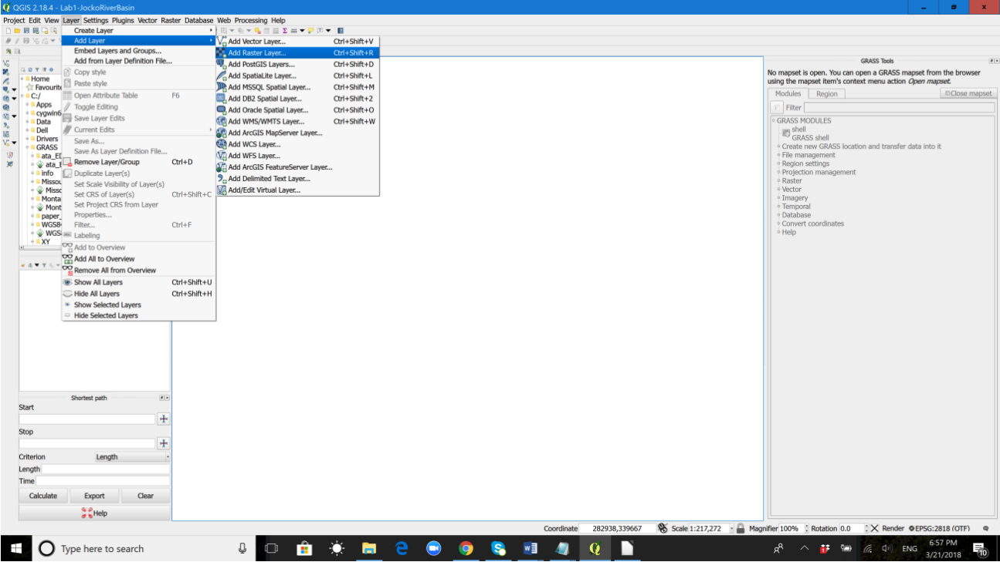
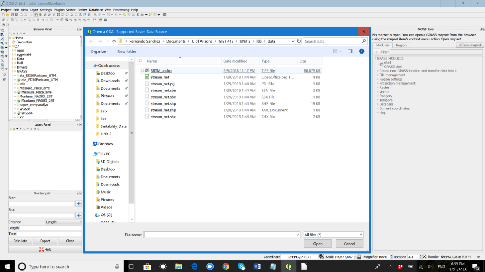
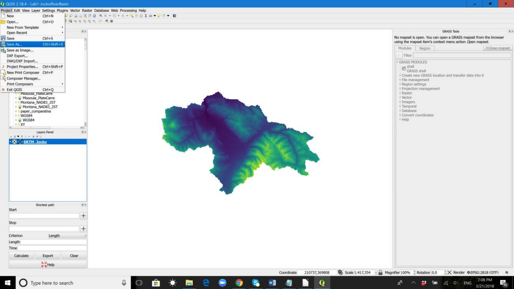
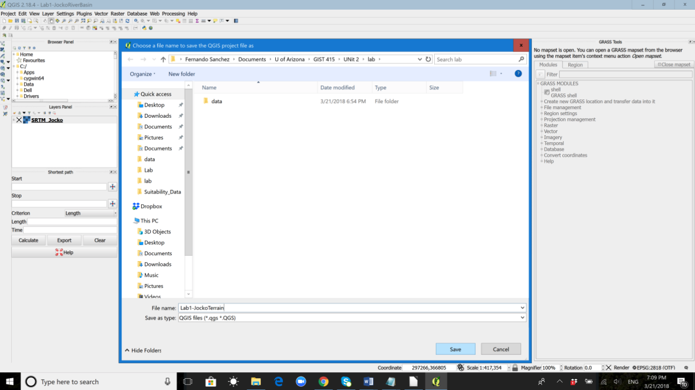
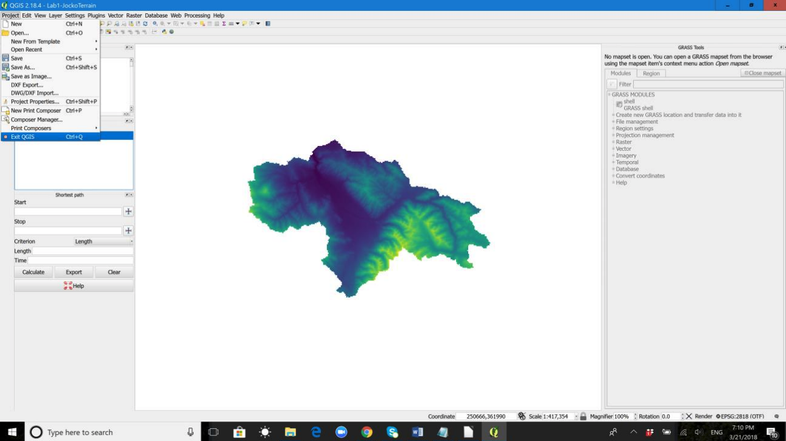
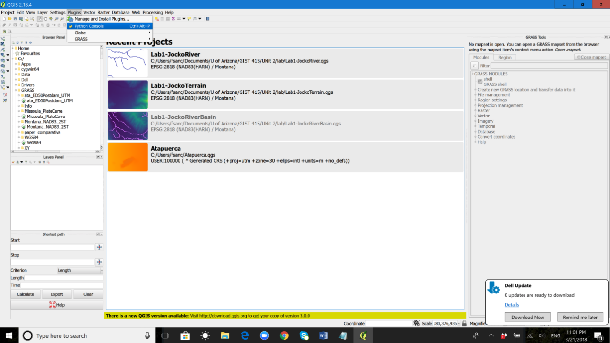
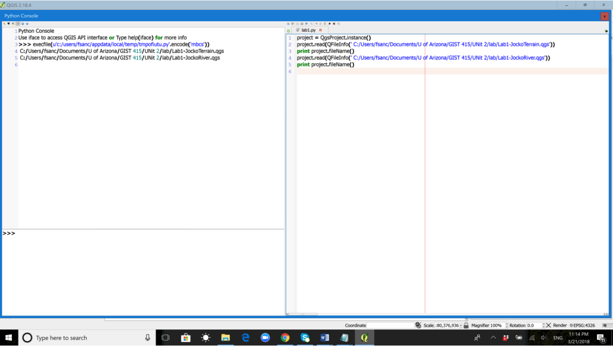
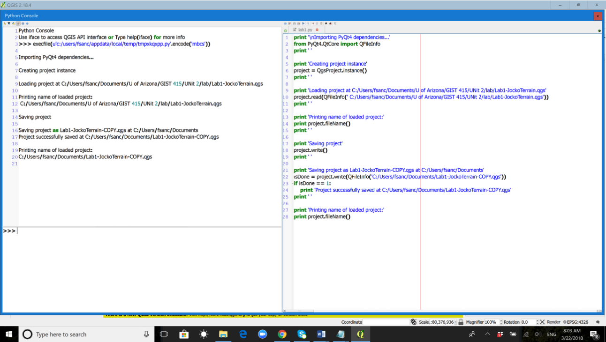

# Unit 2. Starting an Open Source GIS project 
## Activity No.
4.1
## Type of Activity
Laboratory
## Worth 
2 points
## Time effort
6 hrs (est.)
## Topic
Loading QGIS projects
## 1. Introduction
### Overview
Before starting to execute source code, we will create two QGIS projects in your machine:
  1. Open QGIS.
  2. Add the SRTM_Jockoraster dataset (available on D2L) to the current QGIS session.
    1. Layer menu -> Add layer -> Add Raster Layer... -> Browse to the folder containing the file SRTM_Jocko.tiff and select it:
    



    
  3. Save the current session as a QGIS project:
    1. Project menu -> Save as... -> Browse the system to the end folder, enter a project’s name (Lab1-JockoTerrain), and save:
    



  4.Exit QGIS.
    1. Project menu -> Exit QGIS.
    


### Your turn
Repeat Steps 1 through 4 with Shapefile stream_net:
1. Open QGIS.
2. Add the `stream_net` vector dataset to the current QGIS session.
  1. Layermenu -> Add layer-> Add Vector Layer...
    1. Source Type:File
    1. Encoding:System
    1. Data: Browse to the folder containing the file stream_net.shx and select it.
3. Save the current session as a QGIS project:
  1. Project menu -> Save as... -> Browse the system to the end folder, enter a project’s name (Lab1-JockoRiver), and save.
  1. Exit QGIS.
    1.Project menu -> Exit QGIS.
    
#### Question 1
Paste the screenshots 1 to 6 that you obtain when replicating Steps 1 through 4 (Section 1) in handling JockoSRTM.tiff and 
creating the Lab1-Jocko Terrain project.
#### Question 2
Paste screenshots 1 to 6 that you obtain when completing Steps 1 through 4 (Section 1) in handling `stream_net` and 
creating the Lab1-JockoRiver project. 

At this point, you have two QGS projects: `Lab1-JockoTerrain.qgs` and 
`Lab1-JockoRiver.qgs`.

## 2. Reading QGS project files
### Overview
Sometimes  you  need  to  load  an  existing  project  from  a  plugin  orwhen  developing  a  stand-alone  QGIS Python  
application. You load  a  project  into  the  current  QGIS  application with  a `QgsProjectinstance()` object (Line  7),  
by calling its `read()` method and passing  to  it  a `QFileInfo` object  that  contains  the  path where the project 
will be read from (Line 10). The `fileName()` returns that path as a string:

```
# If you are not inside a QGIS console you first need to import
# qgis and PyQt4 classes you will use in this script as shown below
from qgis.core import QgsProject
from PyQt4.QtCore import QFileInfo

# Create a project instance 
project=QgsProject.instance()

# Load aprojectproject.read(QFileInfo('/home/user/projects/my_other_qgis_project.qgs'))
# Print the current project file name and folder path
# The below print command returns u'/home/user/projects/my_other_qgis_project.qgs'
# It will return an empty string if no project hasbeen loaded yet 
print project.fileName()
```
If you are writing a QGIS standalone application, you will need to synchronize the loaded project with the canvas by 
instantiating a `QgsLayerTreeMapCanvasBridge` object, for example:
```
bridge=QgsLayerTreeMapCanvasBridge(QgsProject.instance().layerTreeRoot(),canvas)

# Now you can safely load your project and see it in the canvas
project.read(QFileInfo('/home/user/projects/my_other_qgis_project.qgs'))
```

### Your turn
1. Open QGIS.
2. Go to the Plugins menu -> Open the Python console, or press Ctrl + Alt + P.
3. In the Console window, click on Show Editor...to open the Python editor.




The rest of steps will be executed as Python commands issued in the console and will involve the handling of QGIS projects.
Following code  presented in this section, the below commands have  been entered in the Python console by running the 
source code enteredthe script editor on the right-hand side:


Note that there is a `Run` script button in the Python editor’s menu to run the code, and you can also save your 
script with the `Save` tool in the editor’s menu. In my example, I have saved my script as `Lab1.py`.

#### Question 3
Explain,  line  by  line,  what  order(s)  every command in  Figure  8 from  line  1 to  5 of  the Python script 
sends to the system.

#### Question 4
Assuming you have completed Questions 1 and 2 and therefore have Lab1-JockoTerrainand Lab1-JockoRiveron  your  machine, 
replicate  the  code  listingin  Figure  8 with  the appropriate attributes in your machine (e.g. with the right paths
to the QGS files onyour machine).  Run the code and paste a screenshot like the one provided above.

## 3. Saving QGS project files 
### Overview
In case you need to make some modifications to aproject (for example add or remove some layers) and save these changes, 
you  can  call  the `write()` method  of  your  project  instance. `write()` also  accepts  an optional `QFileInfo` that 
allows you to specify a path where the project will be saved:
```
# Save the project to the same file
project.write()

# ... or to a new file
project.write(QFileInfo('/home/user/projects/my_new_qgis_project.qgs'))
```

Both `read()` and `write()` return a boolean value that you can use to check if the operation was successful.

```
# Save the project to a new file 
isDone = project.write(QFileInfo('/home/user/projects/my_new_qgis_project.qgs'))
if isDone == 1:
    print 'Project successfully saved at /home/user/projects/my_new_qgis_project.qgs'
```

## Your turn
The next listing loads a project (Line 10), then save it “as is” (Line 18) (for now, without having done so much  
in  the  project),  and  finally  saves  it  with  a  different  project  name  and  in  a  different  place  
of  the computer (Line 22):



#### Question 5 
Match lines in the Python console to lines in the Python editor, as shown in Figure 9. For instance, Line 5 (console) -– 
Line 1 (editor). 

#### Question 6
Why   does   Line   28   (editor) in   Figure   9return  “C:/Users/fsanc/Documents/Lab1-JockoTerrain-COPY.qgs”  
instead  of  “C:/Users/fsanc/Documents/UofArizona/GIST 415/UNit 2/lab/Lab1-JockoTerrain.qgs”?

#### Question 7
Replicate  thecode  listing in  Figure  9 with  the  appropriate  attributes  in  your  machine (e.g. with the 
right paths to the QGS files on your machine).  Run the code and paste a screenshot like the one provided above.
