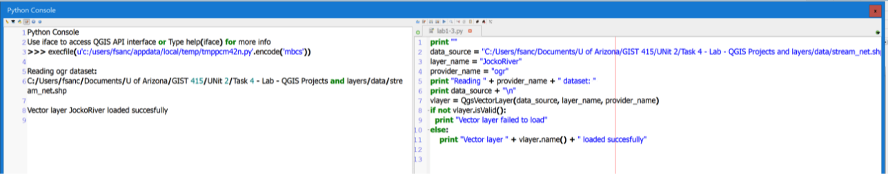

# Unit 2. Starting an Open Source GIS project
## Activity No. 
4.2
## Type of Activity 
Laboratory
## Worth 
2 points
## Time effort 
6 hrs (est.)
## Topic 
Loading GIS data
### [*Vector Layers*](https://docs.qgis.org/2.14/en/docs/pyqgis_developer_cookbook/loadlayer.html#id1)
#### Overview
1. Load a layer
To load a vector layer, you must specify the layer’s data source address, a name for the layer, and the
provider’s name:

```
layer = QgsVectorLayer(data_source, layer_name, provider_name)
if not layer.isValid():
 print "Layer failed to load"
```
- Line 1: The data_source identifier is a string and is specific to each vector data provider (more on
this later), layer_name sets the alias to be used in the layer list widget.
- Line 2: It is good practice to check whether the layer has been loaded successfully.
- Line 3: If the layer is not loaded successfully, you can use a print command to have the interpreter
send an invalid layer message to standard output.

The following list shows how to access various data sources using vector data providers [In this course we
will just demonstrate the use of shapefiles and CSV files]:

##### OGR library (shapefiles and many other file formats)
```
#Shapefile:
vlayer = QgsVectorLayer("/path/to/shapefile/file.shp", "layer_name", "ogr")
#DXF (note the internal parameters within the data source uri):
uri = "/path/to/dxffile/file.dxf|layername=entities|geometrytype=Point"
vlayer = QgsVectorLayer(uri, "layer_name", "ogr")
```

##### PostGIS database
```
uri = QgsDataSourceURI()
# set host name, port, database name, username and password
uri.setConnection("localhost", "5432", "dbname", "johny", "xxx")
# set database schema, table name, geometry column and optionally
# subset (WHERE clause)
uri.setDataSource("public", "roads", "the_geom", "cityid = 2643")
vlayer = QgsVectorLayer(uri.uri(), "layer_name", "postgres")
```

- Line 1: a `QgsDataSourceURI()` is created to manage the connection.
- Line 4: The data source is a `QgsDataSourceURI`-generated string with all the information needed to
create a connection to the PostgreSQL database.
- Note that QGIS has to be compiled with Postgres support, otherwise this provider isn’t available.
CSV or other delimited text files

```
uri = "file:///some/path/file.csv?delimiter=%s&xField=%s&yField=%s" % (";", "x", "y")
vlayer = QgsVectorLayer(uri, "layer_name", "delimitedtext")
```
- Line 1: Note the standard Python string formatting to pass the CSV delimiter (“;” in the example)
and coordinate columns in the CSV file (“x”,”y” in the example).
- From QGIS 1.7, the data source string is structured as a URL so the path must be prefixed
with `file://`.
- QGIS also allows WKT (well-known text) formatted geometries as an alternative to “x” and “y”
fields, and allows the coordinate reference system to be specified, for example:
```
uri = "file:///some/path/file.csv?delimiter=%s&crs=epsg:4723&wktField=%s" % (";", "shape")
vlayer = QgsVectorLayer(uri, "layer_name", "delimitedtext")
```

##### GPX files (“gpx” data on tracks, routes and waypoints)
```
uri = "path/to/gpx/file.gpx?type=track"
vlayer = QgsVectorLayer(uri, "layer name you like", "gpx")
```
- Line 1: To open a file, the type (track, route, or waypoint) needs to be specified as part of the uri.

### SpatiaLite database
```
uri = QgsDataSourceURI()
uri.setDatabase('/home/martin/test-2.3.sqlite')
schema = ''
table = 'Towns'
geom_column = 'Geometry'
uri.setDataSource(schema, table, geom_column)
display_name = 'Towns'
vlayer = QgsVectorLayer(uri.uri(), display_name, 'spatialite')
```
- Like with PostGIS databases, `QgsDataSourceURI()` can be used to create the data source identifier.

##### MySQL WKB-based geometries
```
uri = "MySQL:dbname,host=localhost,port=3306,user=root,password=xxx|layername=mytable"
vlayer = QgsVectorLayer( uri, "my table", "ogr" )
```
- Line 1,2: Data source is the connection string to the table.

2. Load and display a layer
To open and display a vector layer in QGIS, use the `addVectorLayer()` function of the QgisInterface:
```
layer = iface.addVectorLayer("/path/to/shapefile/file.shp", "layer_name", "ogr")
if not layer:
 print "Layer failed to load!"
```
- This creates a new layer and adds it to the map layer registry (i.e. adding it to the layer list) in one
step.
- The function returns the layer instance or None if the layer couldn’t be loaded.

3. Change the data source of a layer
You can change the data source of an existing layer by calling *`setDataSource()`* on
a `QgsVectorLayer` instance, for example:
```
vlayer = QgsVectorLayer("/path/to/shapefile/file.shp", "a_layer_name", "ogr")
uri = QgsDataSourceURI()
uri.setConnection("localhost", "5432", "dbname", "johny", "xxx")
uri.setDataSource("public", "roads", "the_geom", "cityid = 2643")
vlayer.setDataSource(uri.uri(), "another_layer_name ", "postgres")
```
- Line 1: vlayer initially points to file.shp.
- Line 3-5: A PostGIS connection is created.
- Line 7: vlayer is set so it points to the opened PostGIS database.

#### Your turn
Review the below code and answer the below questions:


##### Question 8 - What is vlayer.name()? Is it an attribute or a function? When is it created?
##### Question 9 - In the Python console, what JockoRiver refers to?
- How is this reference created?
##### Question 10 - Repeat the script with the stream_net Shapefile on your machine.
- Add a screenshot of your code and results.

## Raster Layers
Raster file access is managed by the GDAL library. It supports a wide range of file formats. In case you
have troubles with opening some files, check whether your GDAL has support for the particular format
(not all formats are available by default).
### Overview
1. Load a layer
To load a raster from a file, specify its file name and base name [In this course we will just demonstrate
the use of GeoTIFF files], for example:
```
from PyQt4.QtCore import QFileInfo
fileName = "/path/to/raster/file.tif"
fileInfo = QFileInfo(fileName)
baseName = fileInfo.baseName()
rlayer = QgsRasterLayer(fileName, baseName)
if not rlayer.isValid():
 print "Layer failed to load!"
```
2. Load and display a layer
Similarly to vector layers, raster layers can be loaded using the `addRasterLayer()` function of
the QgisInterface:
```
layer = iface.addRasterLayer("/path/to/raster/file.tif", "layer_name")
if not layer:
 print "Layer failed to load!"
```
- This creates a new layer and adds it to the map layer registry (i.e. layer list) in one step.

3. Load a WCS map
Raster layers can also be created from a WCS service:
```
layer_name = 'modis'
uri = QgsDataSourceURI()
uri.setParam('url', 'http://demo.mapserver.org/cgi-bin/wcs')
uri.setParam("identifier", layer_name)
rlayer = QgsRasterLayer(str(uri.encodedUri()), 'my wcs layer', 'wcs')
```
- Detailed URI settings can be found in provider documentation.

4. Load a WCS map
Alternatively you can load a raster layer from WMS server:
```
urlWithParams =
'url=http://wms.jpl.nasa.gov/wms.cgi&layers=global_mosaic&styles=pseudo&format=image/jpeg
&crs=EPSG:4326'
rlayer = QgsRasterLayer(urlWithParams, 'some layer name', 'wms')
if not rlayer.isValid():
 print "Layer failed to load!"
```
- Note that currently it is not possible to access GetCapabilities response from API — you have to
know what layers you want

#### Your turn
Review the below code and answer the following questions:


##### Question 11 - What does type() return?
- Do vector layers have the same method? Use the Python console and the Python
editor to prove your answer. Paste a screenshot with the result.
##### Question 12 - Explain in plain English, line by line, the commands in the entire script.

## Map Layer Registry
If you would like to use an opened layer for rendering, you must add it to the map layer registry. The map
layer registry takes ownership of layers and they can be later accessed from any part of the application by
their unique ID. When the layer is removed from the map layer registry, it gets deleted, too.

```
#Adding a layer to the registry:
QgsMapLayerRegistry.instance().addMapLayer(layer)
#For a list of loaded layers and layer IDs:
QgsMapLayerRegistry.instance().mapLayers()
#Layers are destroyed automatically on exit. To delete a layer explicitly:
QgsMapLayerRegistry.instance().removeMapLayer(layer_id)
```
We will use the registry in the next course units.

# Questionnaire of Lab 1 – Part 2
Please copy this page to a new word file and add your answers below the question header. Then submit
the completed questionnaire to D2L.

| | |
| -- | -- |
| Student name | |
| Unit | 2 |
| Task No. | 4.2 |
| Question 8 | What is vlayer.name()? Is it an attribute or a function? When is it created? |
| Question 9 | In the Python console, what JockoRiver refers to?<br> How is this reference created? |
| Question 10 | Repeat the script with the stream_net Shapefile on your machine.<br>Add a screenshot of your code and results. |
| Question 11 | What does type() return? Do vector layers have the same method? Use the Python console and the Python editor to prove your answer. Paste a screenshot with the result. |
| Question 12 | Explain in plain English, line by line, the commands in the entire script. |
